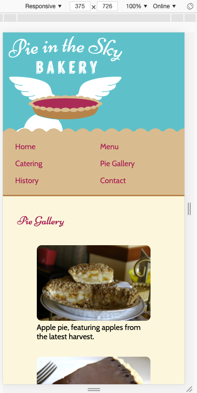
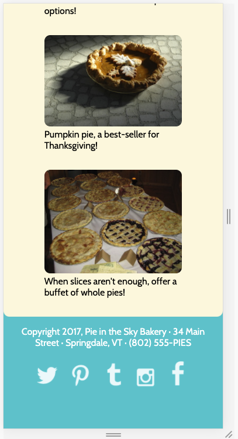
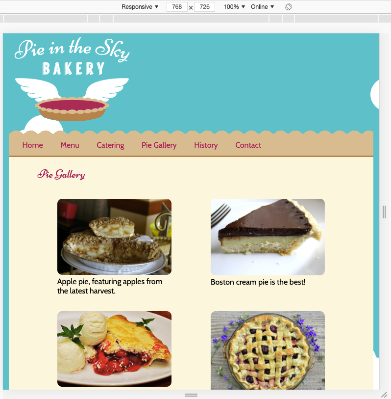
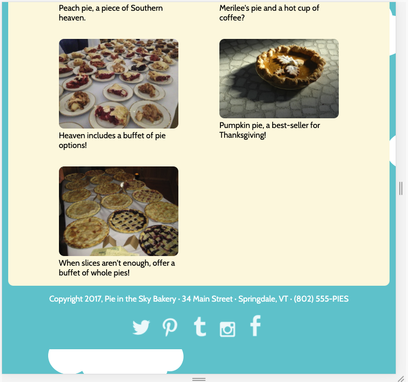
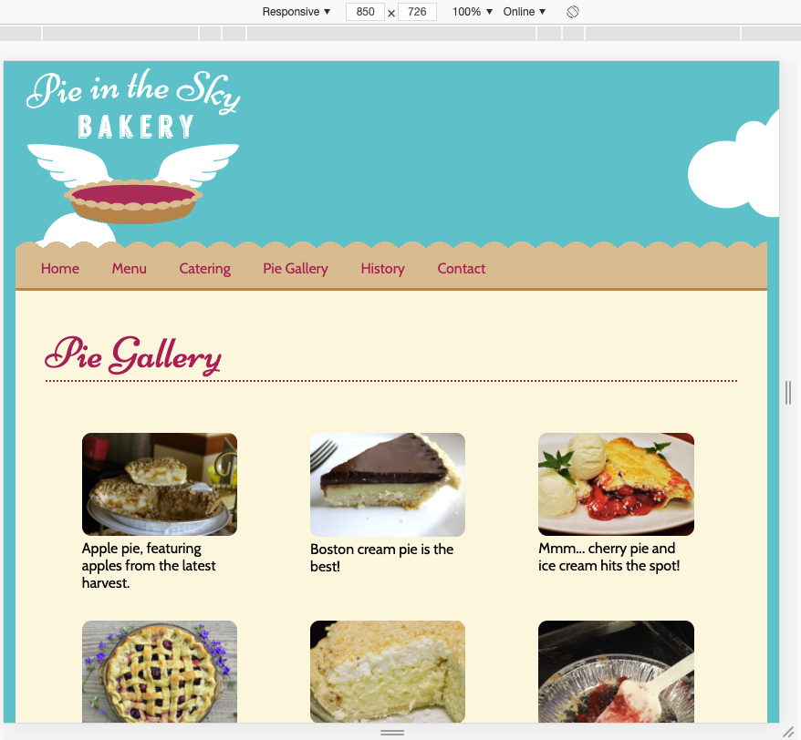
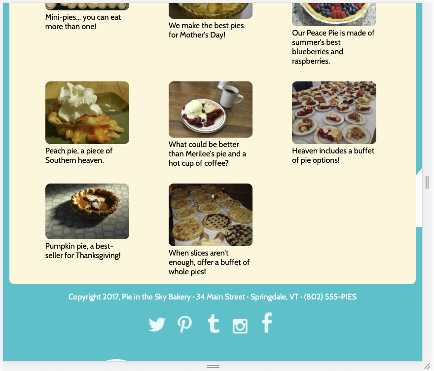

# Project Flexbox page layout

### This Repo is based on:

- tutorial within [Frontendmasters' Beginners Path](https://frontendmasters.com/learn/beginner/)
- tutorial [GitHub](https://github.com/jen4web/fem-layout)
- tutorial video [Floats / Flexbox / CSS-Grid - setup full webpage with flexbox](https://frontendmasters.com/courses/css-grids-flexbox/flexbox-exercise-2-setup-full-webpage-layout/)
- tutorial video [Responsive Image Exercise](https://frontendmasters.com/courses/css-grids-flexbox/responsive-images-exercise/)

### What is this about?

### First part - code changes from floats to flexbox

- exercise "Pie Flexbox" requested some rather minor changes from floats to flexbox to an [already existing responsive code](https://github.com/jen4web/fem-layout/tree/master/day-1-flexbox/4-pie-flexbox), see screenshots down below
- as I found some things in there irritating, not really clean, I've decided as a practice to give it a shot and style it "anew":

  - without using floats together with flexbox (as tutor did in their result)
  - with styling via classes (renamed them as I found their naming not helpful!), not selecting elements
  - in adapting of (superfluous) elements but generally keeping the HTML set-up (copy & paste)
  - in using svgs instead of images within footer, via [fontawesome](https://fontawesome.com/icons?d=gallery&m=free) and [svg check/clean-up via svgomg](https://jakearchibald.github.io/svgomg/)
  - adapt breakpoints to content
  - make prettier (subjective)

### Second part - include a pie image gallery, add new homepage

- take already existing code [Pie Flexbox](https://github.com/jen4web/fem-layout/tree/master/day-1-flexbox/4-pie-flexbox) and [Responsive Images](https://github.com/jen4web/fem-layout/tree/master/day-1-flexbox/6-responsive-images) and follow tasks below
- disclaimer: I took my already modified code from Part One to continue with from there
- Tasks:
  - integrate pie image gallery
  - add new homepage content and styling
  - integrate responsive background banner image on homepage
  - integrate responsive image on History page (Merilee)
  - polyfill

#### My breakpoints (also different from course ones)

- 320px
- 640px
- 880px

### Screenshots of tutorial results - to (vagely) stick to styling

[First Exercise - from floats to flexbox](#first-exercise)

[Second Exercise - pie gallery, new homepage, responsive imgaes](#second-exercise)

#### First Exercise

#### Second Exercise

### How to run this?

- clone this repo
- `cd` into project
- open `index.html` in your browser of choice (in my case, built in/for Chrome)
