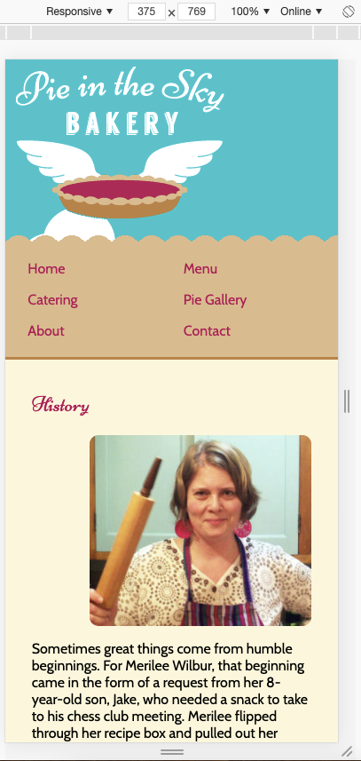
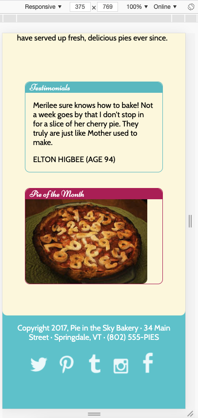
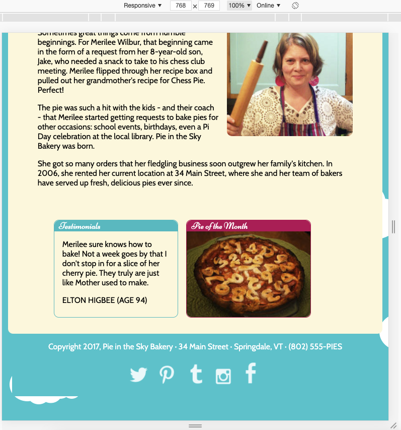
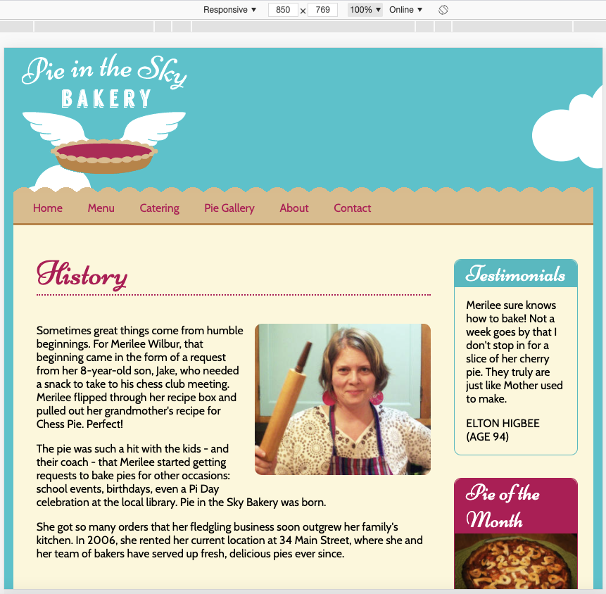
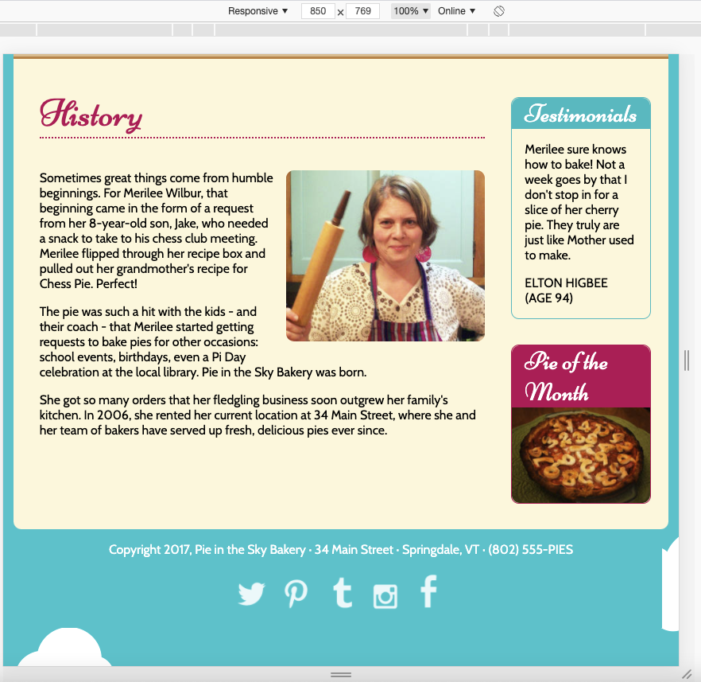

# Project Flexbox page layout

### This Repo is based on:

- tutorial within [Frontendmasters' Beginners Path](https://frontendmasters.com/learn/beginner/)
- tutorial [GitHub](https://github.com/jen4web/fem-layout)
- tutorial video [Floats / Flexbox / CSS-Grid - setup full webpage with flexbox](https://frontendmasters.com/courses/css-grids-flexbox/flexbox-exercise-2-setup-full-webpage-layout/)

### What is this about?

- exercise "Pie Flexbox" requested some rather minor changes from floats to flexbox to an [already existing responsive code](https://github.com/jen4web/fem-layout/tree/master/day-1-flexbox/4-pie-flexbox), see screenshots down below
- as I found some things in there irritating, not really clean, I've decided as a practice to give it a shot and style it "anew":

  - without using floats together with flexbox (as tutor did in their result)
  - with styling via classes (renamed them as I found their naming not helpful!), not selecting elements
  - in adapting of (superfluous) elements but generally keeping the HTML set-up (copy & paste)
  - in using svgs instead of images within footer, via [fontawesome](https://fontawesome.com/icons?d=gallery&m=free) and [svg check/clean-up via svgomg](https://jakearchibald.github.io/svgomg/)
  - adapt breakpoints to content
  - make prettier (subjective)

#### Breakpoints

- debatable (now set up for ~ 320px, 640px, 880px)

#### Used images

- for the default exercise it's not about dynamic exchange of images, maybe a ToDo for later

#### Screenshots of tutorial result

- to (vagely) stick to styling

##### 375px

##### 768px

##### 850px

### How to run this?

- clone this repo
- `cd` into project
- open `index.html` in your browser of choice (in my case, built in/for Chrome)
