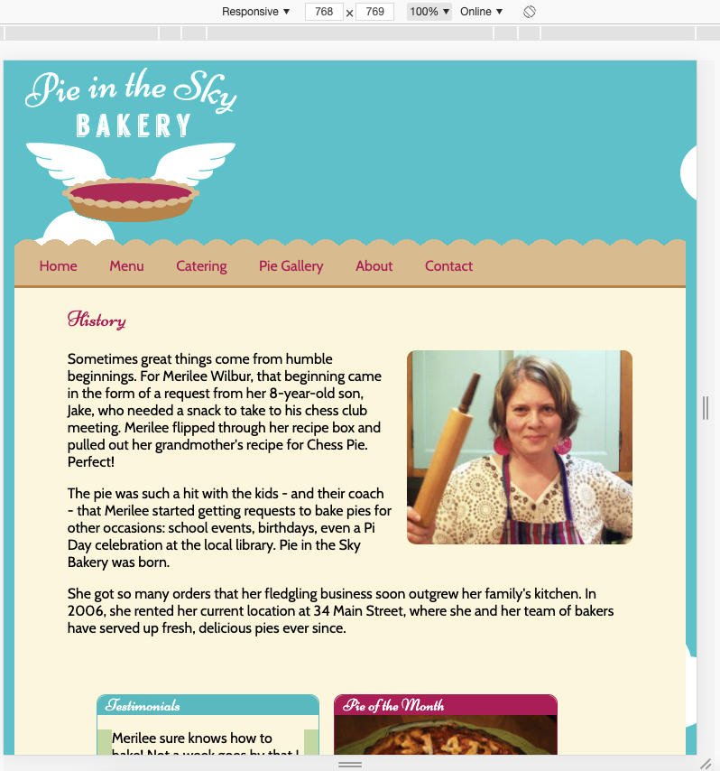

# Project Flexbox page layout - WIP

### This Repo is based on:

- tutorial within [Frontendmasters' Beginners Path](https://frontendmasters.com/learn/beginner/)
- tutorial [GitHub](https://github.com/jen4web/fem-layout)
- tutorial video [Floats / Flexbox / CSS-Grid - setup full webpage with flexbox](https://frontendmasters.com/courses/css-grids-flexbox/flexbox-exercise-2-setup-full-webpage-layout/)

### What is this about?

- within the course, tutorial's exercise "Pie Flexbox" requested some rather minor changes from floats to Flexbox to an [already existing responsive code base](https://github.com/jen4web/fem-layout/tree/master/day-1-flexbox/4-pie-flexbox), see screenshots down below
- as I found quite some things in there irritating, not really clean, I've decided as a practice to give it a shot and build it "anew":

  - without using floats and flexbox (as tutor does in result)
  - with styling via classes, not selecting elements
  - in adapting of (superfluous) elements
  - in using svgs instead of images in footer, via [fontawesome](https://fontawesome.com/icons?d=gallery&m=free) and [svg check/clean-up via svgomg](https://jakearchibald.github.io/svgomg/)
  - etc...

### First Task

- set up mobile view (~320px - 768px) view (breakpoints are not fixed-fixed yet, will be dealt with along the way/what makes sense)

#### Heads-Up

- content (HTML) has been copy & pasted, css has been styled anew
- for the default exercise it's not about dynamic exchange of images, maybe a ToDo for later

### Screenshots of tutorial result

- to (vagely) stick to styling

### How to run this?

- clone this repo
- `cd` into project
- open `index.html` in your browser of choice (in my case, built in/for Chrome)
